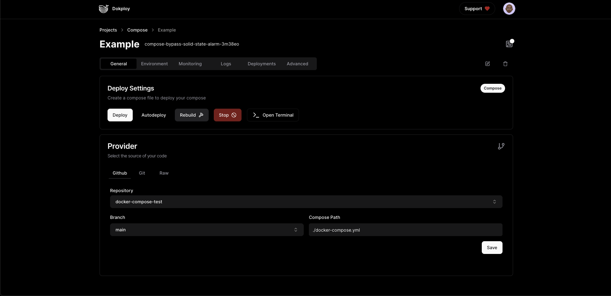
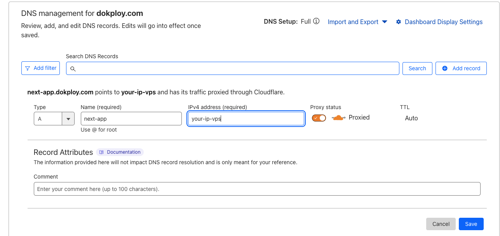
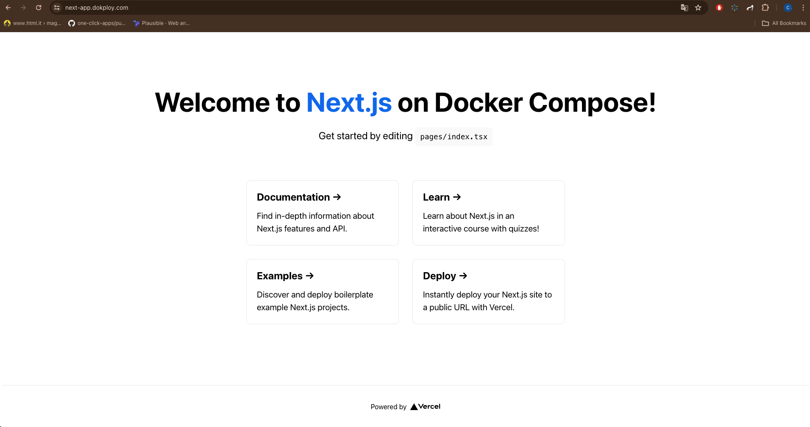

## Tutorial

In this tutorial we will create a simple application using docker compose and routing the traffic to a accessible domain.


### Steps

1. Create a new project
2. Create a new service `Compose` and select the Compose Type `Docker Compose`
3. Fork this repository [Repo](https://github.com/Dokploy/docker-compose-test)
4. Select Provider type Github or Git
5. Select the repository `Dokploy/docker-compose-test`
6. Select the branch `main`
7. Compose Path `./docker-compose.yml` and then save


What are the things you need to add to your existing docker-compose.yml file

1. Add the network `dokploy-network` to each service
2. Add labels for traefik to make the service accessible through the domain

Example:

We have this compose file lets modify it to make it work with dokploy

```yaml
version: "3"

services:
  next-app:
    container_name: next-app
    build:
      context: ./next-app
      dockerfile: prod.Dockerfile
      args:
        ENV_VARIABLE: ${ENV_VARIABLE}
        NEXT_PUBLIC_ENV_VARIABLE: ${NEXT_PUBLIC_ENV_VARIABLE}
    restart: always
    ports:
      - 3000:3000
    networks:
      - my_network
networks:
  my_network:
    external: true
```


We added the network `dokploy-network` to each service and added labels for traefik to make the service accessible through the domain, this is the corrected version of the compose file.

```yaml
version: "3"

services:
  next-app:
    container_name: next-app
    build:
      context: ./next-app
      dockerfile: prod.Dockerfile
      args:
        ENV_VARIABLE: ${ENV_VARIABLE}
        NEXT_PUBLIC_ENV_VARIABLE: ${NEXT_PUBLIC_ENV_VARIABLE}
    restart: always
    ports:
      - 3000
    networks:
      - dokploy-network
    labels:
      - "traefik.enable=true"
      - "traefik.http.routers.<unique-name>.rule=Host(`your-domain.com`)"
      - "traefik.http.routers.<unique-name>.entrypoints=websecure"
      - "traefik.http.routers.<unique-name>.tls.certResolver=letsencrypt"
      - "traefik.http.services.<unique-name>.loadbalancer.server.port=3000"
networks:
  dokploy-network:
    external: true
```

Make sure to point A record to the domain you want to use for your service.



Then you are done to deploy the application, click on deploy and wait for the deployment to complete, then give 10 seconds to traefik generate the certificates and then you can access the application through the domain you have set.



Tips:


1. Make sure to set unique name for each router `traefik.http.routers.<unique-name>` 
2.  Make sure to set unique name for each service `traefik.http.services.<unique-name>`
3. The network make sure to link to the dokploy network `dokploy-network`
4. The labels make sure to set the entrypoint to websecure and the cert resolver to letsencrypt this will generate certificates.

