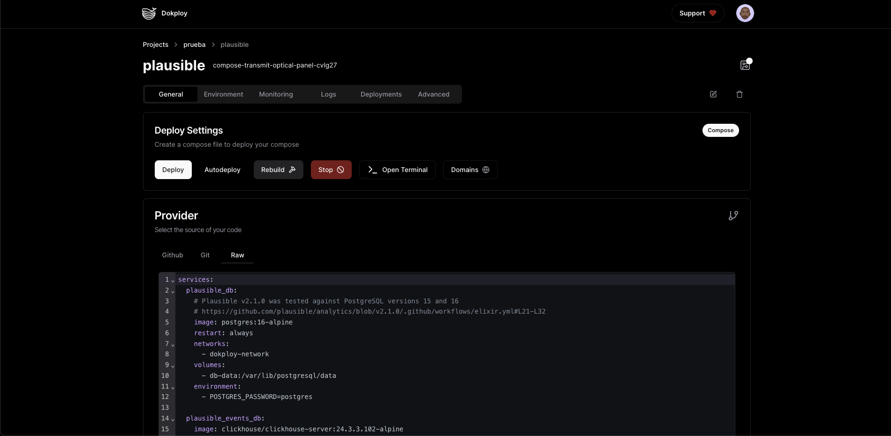

We provide different ways to deploy applications using dokploy, but probably you want to deploy complex applications with multiples services, you an achieve this by using Docker Compose.

Docker Compose is a tool for defining and running multi-container Docker applications. It allows you to define the services and their dependencies in a single file, and then use Docker to start and stop those services.

## Overview

Dokploy provides a easy way to deploy docker compose applications + traefik to balance the traffic to the application and redirect the requests to the right service.

Dokploy includes 2 ways to create docker compose:

- **Docker Compose**: Standard Docker Compose configurations.
- **Stack**: This method is oriented towards orchestrating applications with Docker Swarm. Some features of Docker Compose, such as build, are not available.

Dokploy offers 3 different ways to deploy docker compose applications:

- **Github**: Trigger a deployment from a selected GitHub repository by specifying the Docker Compose file path
- **Git**: Trigger a deployment from a Git repository (Gitea, GitHub, GitLab, Bitbucket) by specifying the Docker Compose file path.
- **Raw**: Paste a Docker Compose file directly into the code editor and trigger a deployment.

### Enviroment

We provide a code editor to specify environment variables for your Docker Compose file. By default, it will create a .env file where you specified the route of your Docker Compose file.

###  Monitoring

We provide a monitoring tool that allows you to monitor each service individually. For example, if you have 10 services, you can monitor each service separately.

### Logs

We provide a log viewer that allows you to view the logs of each service individually.

### Deployments

You can see the last 10 logs of the build of your Compose file.

### Advanced

1. Command: Dokploy has a defined command to run the Docker Compose file, ensuring complete control through the UI. However, you can append flags or options to the command.
2. Volumes: We provide a way to create files and folders on the server when you deploy your application. Every time you deploy an application, it will recreate the files with the specified content.

