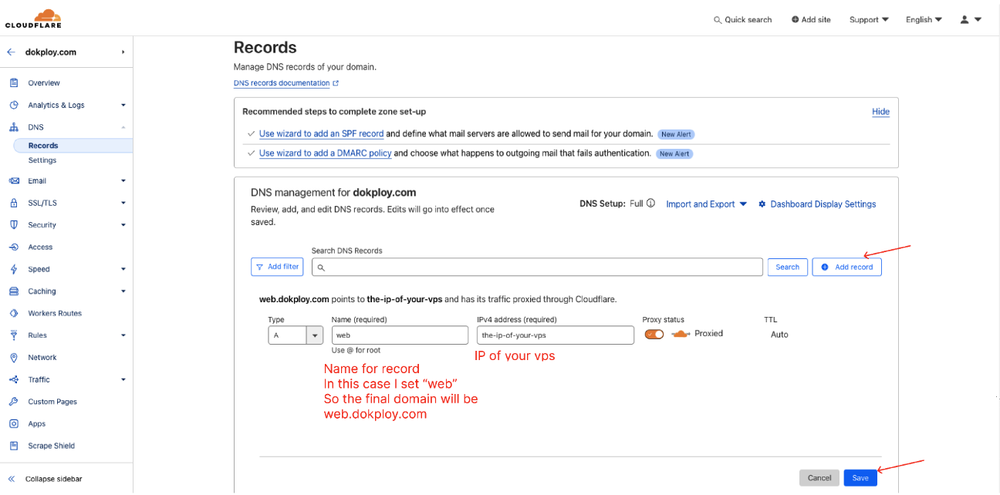
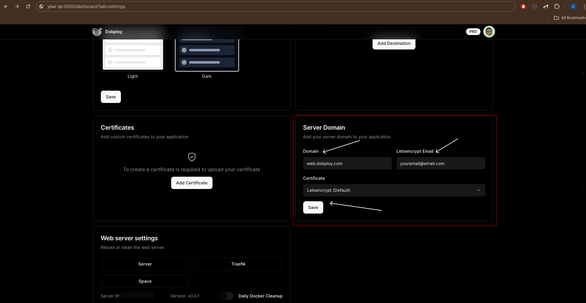

## Introduction

This guide covers the basic setup of a main domain for your Dokploy panel.

## Requirements

Before beginning, ensure you have a domain purchased from one of the following providers:

- [Cloudflare](https://www.cloudflare.com/)
- [Namecheap](https://www.namecheap.com/domains/)
- [Name.com](https://www.name.com/)
- [GoDaddy](https://www.godaddy.com/)
- [Domain.com](https://www.domain.com/)

## Transfer Setup

We recommend transferring your domain to Cloudflare for enhanced security and tools:

- [Transfer Domain to Cloudflare](https://developers.cloudflare.com/registrar/get-started/transfer-domain-to-cloudflare/)

## DNS Setup

Use [Cloudflare](https://www.cloudflare.com/) for DNS management:

1. Log in to Cloudflare and navigate to `Websites` -> `Your Domain` -> `DNS` -> `Records`.
2. Click on `Add record`, select `A`.
3. Enter `web` in the name field and your IP address (e.g., `1.2.3.4`) in the value field.
4. Save the record. Your DNS record will be `web.dokploy.com`.

## Dokploy Panel Setup

1. Log in to your Dokploy panel.
2. Navigate to `/dashboard/settings/server`.
3. Under Server domain, set your domain to match the one configured in Cloudflare (e.g., `web.dokploy.com`).
4. Save and allow about 20 seconds for changes to apply.
5. Access your panel via `https://web.dokploy.com`.

