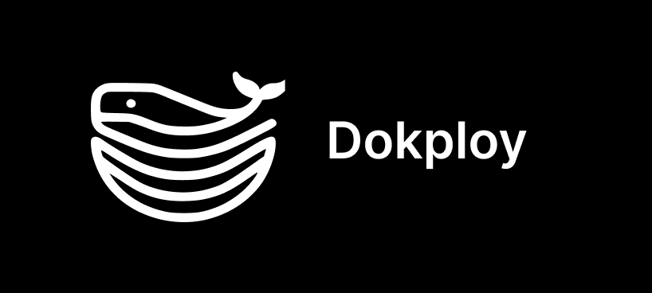

import { Card, CardGrid,LinkCard } from '@astrojs/starlight/components';

## Welcome to Dokploy

Dokploy is a stable, easy-to-use deployment solution designed to simplify the application management process. Think of Dokploy as your free self hostable alternative to platforms like Heroku, Vercel, and Netlify, leveraging the robustness of [Docker](https://www.docker.com/) and the flexibility of [Traefik](https://traefik.io/).

## Why Choose Dokploy?

- **Simplicity:** Easy setup and management of deployments.
- **Flexibility:** Supports a wide range of applications and databases.
- **Open Source:** Free and open-source software, available for anyone to use.

## Setting up Dokploy

Getting started with Dokploy is straightforward. Follow our guides to install and configure your applications and databases effectively.

## Setting up

Please go to get started.

<CardGrid >

<LinkCard
  title="Installation"
  description="Learn how to install Dokploy."
  href="/get-started/installation/"
/>

<LinkCard
  title="Applications"
  description="Learn how to deploy applications."
  href="/application/overview"
/>

<LinkCard
  title="Databases"
  description="Learn how to deploy databases."
  href="/database/overview"
/>

<LinkCard
  title="Traefik"
  description="Learn how to deploy Traefik."
  href="/traefik/overview"
/>
   
</CardGrid>

